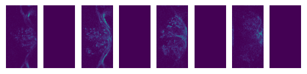

An introduction to ``SiffPy``
=============================

One major downside to collecting FLIM (fluorescence lifetime imaging
microscopy) data is that it does not naturally conform to the structure
of an array: samples with high temporal resolution (like the 5
picoseconds of the PicoQuant MultiHarp) will be very sparse data, with
thousands of possible arrival times per pixel and most of those data
being zeros. And so instead of exporting a standard ``.tiff`` file,
``ScanImage-FLIM`` saves data in the ``.siff`` format, which uses a
``.tiff``-like format to store FLIM data. But because this is not a
standard ``.tiff`` file, it needs its own reader. ``SiffPy`` exists to
extract the data from ``.siff`` files and transform them into ``numpy``
arrays and ``Python`` objects that can be easily piped into standard
workflows.

This page contains examples for some simple workflows that are
constrained entirely to ``SiffPy`` or external pacakges. There are also
other packages that exist with the intention of working with ``SiffPy``
(e.g. ``SiffROI``, ``siff-napari``) that do this job as well. For this
example, we will use a very small ``.siff`` file, but all the usual
semantics will still hold

File I/O
--------

The first thing we need to do, of course, is read a file! The main tool
of ``SiffPy`` is the ``SiffReader`` object, which provides a basic API
for returning ``ndarray`` objects. A ``SiffReader`` can be initialized
with a path to a ``.siff`` file, which will be opened automatically, or
it can be initialized in isolation and a file can be passed later with
the ``open`` function:

::

   sr = SiffReader()

   # collect some user input, other info
   ...

   sr.open(path_to_file)

but the most common use case is as below. File opening is generally
pretty fast (no more than a few seconds for several-GB files), but if
you’re reading data from a mounted server that’s not local, I haven’t
optimized the reader to maximize bandwidth yet and it can be slow.

Note the skipped frames below – data acquisition goes by color channel,
and in this example there are two color channels but only one with
signal!

.. code:: ipython3

    from siffpy import SiffReader
    import matplotlib.pyplot as plt
    
    # file_path can be a string or a pathlib.Path object,
    # or anything that can be cast to a pathlib.Path object
    #file_path = 'path/to/file.siff'
    file_path = '/Users/stephen/Desktop/Data/imaging/2024-05/2024-05-27/SS02255_greenCamui_alpha/Fly1/FB_1.siff'
    
    sr = SiffReader(file_path)
    
    # Returns a `numpy` array of the photon count (i.e. intensity) data
    # contained in the frames indexed as in the provided `frames`
    # argument.
    first_few_frame_indices = list(range(8))
    first_frames = sr.get_frames(frames = first_few_frame_indices)
    
    f, axes = plt.subplots(1, len(first_frames))
    for i, x in enumerate(axes):
        x.axis('off')
        x.set_aspect('equal')
        x.set_adjustable('box')
        x.imshow(first_frames[i])

ImParams and figuring out which frames to load
~~~~~~~~~~~~~~~~~~~~~~~~~~~~~~~~~~~~~~~~~~~~~~

The ``SiffReader`` object will now have a ``im_params`` attribute that
points to an ``ImParams`` object, an interface for accessing the
metadata in the ``.siff`` file. Printing the ``ImParams`` object will
report some of this metadata (e.g. the number of frames). Some of it is
stored in the metadata of the ScanImage modules, which can be accessed
like attributes.

.. code:: ipython3

    im_par = sr.im_params
    print(im_par)

.. parsed-literal::

    Image parameters: 
    	ScanImage modules : 
    		base
    		Beams
    		CameraManager
    		Channels
    		ConfigurationSaver
    		CoordinateSystems
    		CycleManager
    		Display
    		FastZ
    		IntegrationRoiManager
    		MotionManager
    		Motors
    		Photostim
    		Pmts
    		RoiManager
    		Scan2D
    		Shutters
    		StackManager
    		TileManager
    		UserFunctions
    		WSConnector
    		WaveformManager
    	_num_frames_from_siffio : 94306
    	roi_groups : {'imagingRoiGroup': 
            ROI group Default Imaging ROI Group with
            1 ROI(s):
    
            
            ROI  with
            13 scanfield(s):
    
            {'ver': 1, 'classname': 'scanimage.mroi.scanfield.fields.RotatedRectangle', 'name': 'Default Imaging Scanfield', 'UserData': None, 'roiUuid': '9DB51A994047081F', 'roiUuiduint64': 1.136401848e+19, 'centerXY': [0, 0], 'sizeXY': [0.9, 1.8], 'rotationDegrees': 0, 'enable': 1, 'pixelResolutionXY': [128, 256], 'pixelToRefTransform': [[0.00703125, 0, -0.453515625], [0, 0.00703125, -0.903515625], [0, 0, 1]], 'affine': [[0.9, 0, -0.45], [0, 1.8, -0.9], [0, 0, 1]]}
            
            , 'integrationRoiGroup': 
            ROI group  with
            1 ROI(s):
    
            
            ROI  with
            1 scanfield(s):
    
            
            
            }
    

.. code:: ipython3

    print(im_par.FastZ)

.. parsed-literal::

    FastZ module: 
    	submodules : {}
    	actuatorLag : 0
    	discardFlybackFrames : True
    	enable : True
    	enableFieldCurveCorr : False
    	errorMsg : 
    	flybackTime : 0.015
    	hasFastZ : True
    	name : SI FastZ
    	numDiscardFlybackFrames : 1
    	position : -45
    	reserverInfo : 
    	userInfo : 
    	volumePeriodAdjustment : -0.0006
    	warnMsg : 
    	waveformType : sawtooth

The most useful thing you’ll likely use the ``ImParams`` object to do is
call its framelist functions. These use the ScanImage metadata to
compute which frames in the ``.siff`` file correspond to which parts of
the imaging volume / session. This way you don’t need to figure out
things like what order frames are in, which frames to skip because
they’re flyback, etc. etc. For more information, please check the
``SiffReader`` documentation and the ``ImParams`` one.

.. code:: ipython3

    # Get the indices of all frames by timepoint (i.e. across all planes, technically
    # slightly separated in time). Note that this example skips frame 6, which
    # in this experiment was a flyback frame
    im_par.flatten_by_timepoints(timepoint_start = 0, timepoint_end = 10)

.. parsed-literal::

    [0,
     2,
     4,
     6,
     8,
     10,
     14,
     16,
     18,
     20,
     22,
     24,
     28,
     30,
     32,
     34,
     36,
     38,
     42,
     44,
     46,
     48,
     50,
     52,
     56,
     58,
     60,
     62,
     64,
     66,
     70,
     72,
     74,
     76,
     78,
     80,
     84,
     86,
     88,
     90,
     92,
     94,
     98,
     100,
     102,
     104,
     106,
     108,
     112,
     114,
     116,
     118,
     120,
     122,
     126,
     128,
     130,
     132,
     134,
     136]

You can also ask for just the frames of a specific z plane

.. code:: ipython3

    im_par.flatten_by_timepoints(timepoint_start = 0, timepoint_end = 10, reference_z = 3)

.. parsed-literal::

    [6, 20, 34, 48, 62, 76, 90, 104, 118, 132]

If you want all of the frames corresponding to a given
slice/color/whatever, use the ``framelist_by_x`` methods:

.. code:: ipython3

    print ("All frames with color channel 0:")
    print(im_par.framelist_by_color(color_channel = 0, lower_bound_timepoint = 0, upper_bound_timepoint=10))
    
    print("All frames in timepoint < 5 in the third slice:")
    print(im_par.framelist_by_slices(color_channel=0, lower_bound = 0, upper_bound=5, slices = [2]))

.. parsed-literal::

    All frames with color channel 0:
    [0, 2, 4, 6, 8, 10, 14, 16, 18, 20, 22, 24, 28, 30, 32, 34, 36, 38, 42, 44, 46, 48, 50, 52, 56, 58, 60, 62, 64, 66, 70, 72, 74, 76, 78, 80, 84, 86, 88, 90, 92, 94, 98, 100, 102, 104, 106, 108, 112, 114, 116, 118, 120, 122, 126, 128, 130, 132, 134, 136]
    All frames in timepoint < 5 in the third slice:
    [4, 18, 32, 46, 60]

Now we can get all of the frames from, let’s say, the fourth plane

.. code:: ipython3

    slice_frames = sr.get_frames(frames = im_par.framelist_by_slices(color_channel=0, slices = [3]))
    print(slice_frames.shape)

.. parsed-literal::

    (6736, 256, 128)

Or we can get the whole imaging series and then reshape it

.. code:: ipython3

    full_session = (
        sr
        .get_frames(frames=sr.im_params.flatten_by_timepoints(color_channel=None))
        .reshape(sr.im_params.array_shape)
    )
    
    print([
        f"{dim_name}: {dim_val}"
        for dim_name, dim_val in zip(("timepoints", "slices", "channels", "rows", "columns"),full_session.shape)
        ]
    )

.. parsed-literal::

    ['timepoints: 6736', 'slices: 6', 'channels: 2', 'rows: 256', 'columns: 128']

.. code:: ipython3

    import matplotlib.pyplot as plt
    
    f, x = plt.subplots(1, full_session.shape[1], figsize=(10, 5))
    
    for plane, ax in zip(range(full_session.shape[1]), x):
        ax.imshow(full_session[:,plane, 0, ...].mean(axis=0).squeeze())
        ax.axis("off")
        

.. image:: basic_use_notebook_files/basic_use_notebook_16_0.png

Registration
------------

Almost all imaging sessions will have some motion artifacts. We need to
do some image registration to correct those and align to a template. The
template is also usually very useful for drawing ROIs, since it’s
generally some form of consensus image across the timeseries. In this
section, we will look at the tools for registration built in to
``SiffPy`` and explore how to pipe these data into another registration
pipeline of our choice. There are native registration tools mainly
because: 1) Many pipelines want to take in a ``.tiff`` file, which we
just don’t have! Even if you *do* convert the ``.siff`` to a ``.tiff``,
you’ll lose the photon arrival time data! 2) The ``SiffIO`` object will
perform rigid registration in-place, rather than duplicating the data,
so it accepts a dictionary of pixel shifts and reassigns pixels in
frames as it reads them from disk.

For more info please refer to
:literal:`{eval-rst} :ref:\`registration\``

.. code:: ipython3

    # SiffPy as a registration method is probably one of the worse ones,
    # but it doesn't require any additional dependencies! If you have `suite2p`
    # installed, you can use that instead as below.
    registration_dict = sr.register(registration_method='siffpy', alignment_color_channel=0)
    
    # On my Macbook Pro, this takes about 2 minutes for our 7,000 volume 256x128 frame data
    
    #registration_dict is also stored in the siffreader as sr.registration_dict, but more info
    # is in the RegistrationInfo object
    sr.registration_info

The registration_dict is also stored in the siffreader as
``sr.registration_dict``, but more info is in the ``RegistrationInfo``
object

.. code:: ipython3

    reg_info = sr.registration_info
    print(reg_info)
    print(reg_info.yx_shifts)
    
    f, axes = plt.subplots(1, len(reg_info.reference_frames), figsize=(10, 5))
    
    for i, x in enumerate(axes):
        x.axis("off")
        x.imshow(
            reg_info.reference_frames[i].squeeze()
        )

.. code:: ipython3

    # If your siffreader performed the registration, it will also automatically use it unless you override the
    # registration_dict keyword argument, but
    # I'm spelling out its use here for clarity
    registered_frames = sr.get_frames(frames = first_few_frame_indices, registration_dict = reg_info.yx_shifts)
    print(registered_frames.shape)

There are multiple registration packages available. Let’s try the same
with ``suite2p``. It goes faster and tends to look better! In this case,
it took 80 seconds, a 30% speedup compared to my crappy implementation

.. code:: ipython3

    sr.register(registration_method='suite2p', alignment_color_channel=0)

.. code:: ipython3

    reg_info = sr.registration_info
    print(reg_info)
    print(reg_info.yx_shifts)
    
    f, axes = plt.subplots(1, len(reg_info.reference_frames), figsize=(10, 5))
    
    for i, x in enumerate(axes):
        x.axis("off")
        x.imshow(
            reg_info.reference_frames[i].squeeze()
        )

The reference frames look nicer too..

Masking methods
===============

Often we want to do more than just read a file and make pretty pictures.
We generally want to analyze certain subregions of the image, often
called ``masks`` or ``ROI``\ s. ``SiffPy`` provides some methods for
this type of analysis: the ``mask`` methods.

``Mask`` objects are ``numpy`` arrays of ``dtype=bool``. Because
``SiffPy`` reads frames lazily rather than making one giant image, it is
often easier and faster to ask it only to read the portions
corresponding to the mask. Let’s start by creating a simple mask that
only grabs the top half of each frame, and compare the speed and
numerical output of each of the various ways of calculating the
intensity within that ROI across the dataset.

.. code:: ipython3

    import numpy as np
    # Make a mask that is just the top half of the frame
    mask = np.ones(sr.im_params.shape, dtype=bool)
    mask[mask.shape[0]//2:, ...] = False

.. code:: ipython3

    # Produces a raw sum of the photon counts in the masked region
    # across all timepoints, then collapses the volume sum into a
    # single value, this is used for multi-plane masks spanning a
    # volume. This method takes the same amount of time -- 5.5 seconds
    collapsed = sr.sum_mask(mask)
    print(collapsed.shape, collapsed)

.. code:: ipython3

    %%timeit
    # Just plain ol' summing the photon counts in the masked region.
    # Takes 3.41 seconds for me
    framewise = sr.sum_mask(mask)

.. parsed-literal::

    3.37 s ± 47.5 ms per loop (mean ± std. dev. of 7 runs, 1 loop each)

.. code:: ipython3

    %%timeit
    # By comparison, doing the same operation from the raw intensity data takes 4.39 seconds!
    # This seems to argue there's some benefit to using the `SiffReader` mask method even
    # for something this trivial
    
    from_raw = (
        sr.get_frames(
            frames = sr.im_params.flatten_by_timepoints(),
            registration_dict = sr.registration_dict
        )
        * mask
    ).sum(axis=(-1,-2))

.. parsed-literal::

    4.23 s ± 46 ms per loop (mean ± std. dev. of 7 runs, 1 loop each)

.. code:: ipython3

    # Of course, they agree:
    (from_raw == framewise).all()

.. parsed-literal::

    True

This method works well with multiple ROIs if you call the ``sum_masks``
method. If you were to use ``sum_mask`` over and over, you’d have to
read the image file every time – making it tremendously slow. But if you
apply all of the masks during one read with ``sum_masks``, you can apply
all of the masks during the first read. This way you don’t have to load
the whole (sometimes many 100,000s of frames) into memory first as you
would if you start with ``get_frames`` – you can do it lazily during the
read.

This ends up performing comparably when the overall image is kind of
small, and very (comparatively) efficiently in more memory-limited
applications

.. code:: ipython3

    base_mask = np.zeros(sr.im_params.single_channel_volume, dtype=bool)
    # A vertical stripe on the left edge of the image in each plane
    base_mask[..., :base_mask.shape[-1]//10] = True
    
    # The masks will shift the position of the vertical stripe to the right
    masks = [
        np.roll(base_mask, i*base_mask.shape[-1]//10, axis=-1)
        for i in range(10)
    ]

.. code:: ipython3

    %%timeit
    # 9 to 10 seconds -- not so shabby for 10 masks considering a single mask took about 3 or 4 seconds.
    sr.sum_masks(masks)

.. parsed-literal::

    9.63 s ± 63.8 ms per loop (mean ± std. dev. of 7 runs, 1 loop each)

.. code:: ipython3

    %%timeit
    # Get the frames once so we don't repeat the read -- but still requires loading
    # the entire array into memory. This also takes about 10 seconds!
    frames = (
        sr.get_frames(frames = sr.im_params.flatten_by_timepoints())
        .reshape(-1, *sr.im_params.single_channel_volume)
    )
    
    np.array(
        [
            frames[:, submask]
            .sum(axis=(-1,-2))
            for submask in masks
        ]
    )

.. parsed-literal::

    8.53 s ± 78.8 ms per loop (mean ± std. dev. of 7 runs, 1 loop each)

