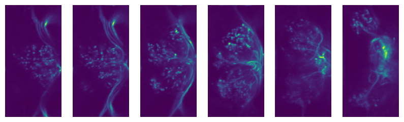
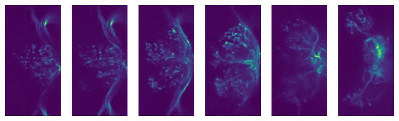

An introduction to ``SiffPy``
=============================

One major downside to collecting FLIM (fluorescence lifetime imaging
microscopy) data is that it does not naturally conform to the structure
of an array: samples with high temporal resolution (like the 5
picoseconds of the PicoQuant MultiHarp) will be very sparse data, with
thousands of possible arrival times per pixel and most of those data
being zeros. And so instead of exporting a standard ``.tiff`` file,
``ScanImage-FLIM`` saves data in the ``.siff`` format, which uses a
``.tiff``-like format to store FLIM data. But because this is not a
standard ``.tiff`` file, it needs its own reader. ``SiffPy`` exists to
extract the data from ``.siff`` files and transform them into ``numpy``
arrays and ``Python`` objects that can be easily piped into standard
workflows.

This page contains examples for some simple workflows that are
constrained entirely to ``SiffPy`` or external pacakges. There are also
other packages that exist with the intention of working with ``SiffPy``
(e.g. ``SiffROI``, ``siff-napari``) that do this job as well. For this
example, we will use a very small ``.siff`` file, but all the usual
semantics will still hold

File I/O
--------

The first thing we need to do, of course, is read a file! The main tool
of ``SiffPy`` is the ``SiffReader`` object, which provides a basic API
for returning ``ndarray`` objects. A ``SiffReader`` can be initialized
with a path to a ``.siff`` file, which will be opened automatically, or
it can be initialized in isolation and a file can be passed later with
the ``open`` function:

::

   sr = SiffReader()

   # collect some user input, other info
   ...

   sr.open(path_to_file)

but the most common use case is as below. File opening is generally
pretty fast (no more than a few seconds for several-GB files), but if
you’re reading data from a mounted server that’s not local, I haven’t
optimized the reader to maximize bandwidth yet and it can be slow.

.. code:: ipython3

    from siffpy import SiffReader
    import matplotlib.pyplot as plt
    
    # file_path can be a string or a pathlib.Path object,
    # or anything that can be cast to a pathlib.Path object
    #file_path = 'path/to/file.siff'
    file_path = '/Users/stephen/Desktop/Data/imaging/2023-09-20/SS00238FLIMAKAR/Fly1/BarOnAtTen_1.siff'
    
    sr = SiffReader(file_path)
    
    # Returns a `numpy` array of the photon count (i.e. intensity) data
    # contained in the frames indexed as in the provided `frames`
    # argument.
    first_few_frame_indices = [0,1,2,3]
    first_frames = sr.get_frames(frames = first_few_frame_indices)
    
    f, axes = plt.subplots(1, len(first_frames))
    for i, x in enumerate(axes):
        x.axis('off')
        x.set_aspect('equal')
        x.set_adjustable('box')
        x.imshow(first_frames[i])

.. image:: basic_use_notebook_files/basic_use_notebook_2_0.png

ImParams and figuring out which frames to load
~~~~~~~~~~~~~~~~~~~~~~~~~~~~~~~~~~~~~~~~~~~~~~

The ``SiffReader`` object will now have a ``im_params`` attribute that
points to an ``ImParams`` object, an interface for accessing the
metadata in the ``.siff`` file. Printing the ``ImParams`` object will
report some of this metadata (e.g. the number of frames). Some of it is
stored in the metadata of the ScanImage modules, which can be accessed
like attributes.

.. code:: ipython3

    im_par = sr.im_params
    print(im_par)

.. parsed-literal::

    Image parameters: 
    	ScanImage modules : 
    		base
    		Beams
    		CameraManager
    		Channels
    		ConfigurationSaver
    		CoordinateSystems
    		CycleManager
    		Display
    		FastZ
    		IntegrationRoiManager
    		MotionManager
    		Motors
    		Photostim
    		Pmts
    		RoiManager
    		Scan2D
    		Shutters
    		StackManager
    		TileManager
    		UserFunctions
    		WSConnector
    		WaveformManager
    	_num_frames_from_siffio : 387
    	roi_groups : {'imagingRoiGroup': 
            ROI group Default Imaging ROI Group with
            1 ROI(s):
    
            
            ROI Default Imaging Roi with
            1 scanfield(s):
    
            Scanfield Default Imaging Scanfield with parameters:
    	{'ver': 1, 'classname': 'scanimage.mroi.scanfield.fields.RotatedRectangle', 'name': 'Default Imaging Scanfield', 'UserData': None, 'roiUuid': 'E981838A77ED882E', 'roiUuiduint64': 1.682587431e+19, 'centerXY': [0, 0], 'sizeXY': [2, 2], 'rotationDegrees': 0, 'enable': 1, 'pixelResolutionXY': [256, 256], 'pixelToRefTransform': [[0.0078125, 0, -1.00390625], [0, 0.0078125, -1.00390625], [0, 0, 1]], 'affine': [[2, 0, -1], [0, 2, -1], [0, 0, 1]]}
            
            , 'integrationRoiGroup': 
            ROI group  with
            1 ROI(s):
    
            
            ROI  with
            1 scanfield(s):
    
            
            
            }
    

.. code:: ipython3

    print(im_par.FastZ)

.. parsed-literal::

    FastZ module: 
    	submodules : {}
    	actuatorLag : 0
    	discardFlybackFrames : True
    	enable : True
    	enableFieldCurveCorr : False
    	errorMsg : 
    	flybackTime : 0.015
    	hasFastZ : True
    	name : SI FastZ
    	numDiscardFlybackFrames : 1
    	position : -30
    	reserverInfo : 
    	userInfo : 
    	volumePeriodAdjustment : -0.0006
    	warnMsg : 
    	waveformType : sawtooth

The most useful thing you’ll likely use the ``ImParams`` object to do is
call its framelist functions. These use the ScanImage metadata to
compute which frames in the ``.siff`` file correspond to which parts of
the imaging volume / session. This way you don’t need to figure out
things like what order frames are in, which frames to skip because
they’re flyback, etc. etc. For more information, please check the
``SiffReader`` documentation and the ``ImParams`` one.

.. code:: ipython3

    # Get the indices of all frames by timepoint (i.e. across all planes, technically
    # slightly separated in time). Note that this example skips frame 6, which
    # in this experiment was a flyback frame
    im_par.flatten_by_timepoints(timepoint_start = 0, timepoint_end = 10)

.. parsed-literal::

    [0,
     1,
     2,
     3,
     4,
     5,
     7,
     8,
     9,
     10,
     11,
     12,
     14,
     15,
     16,
     17,
     18,
     19,
     21,
     22,
     23,
     24,
     25,
     26,
     28,
     29,
     30,
     31,
     32,
     33,
     35,
     36,
     37,
     38,
     39,
     40,
     42,
     43,
     44,
     45,
     46,
     47,
     49,
     50,
     51,
     52,
     53,
     54,
     56,
     57,
     58,
     59,
     60,
     61,
     63,
     64,
     65,
     66,
     67,
     68]

You can also ask for just the frames of a specific z plane

.. code:: ipython3

    im_par.flatten_by_timepoints(timepoint_start = 0, timepoint_end = 10, reference_z = 3)

.. parsed-literal::

    [3, 10, 17, 24, 31, 38, 45, 52, 59, 66]

If you want all of the frames corresponding to a given
slice/color/whatever, use the ``framelist_by_x`` methods:

.. code:: ipython3

    print ("All frames with color channel 0:")
    print(im_par.framelist_by_color(color_channel = 0, lower_bound_timepoint = 0, upper_bound_timepoint=10))
    
    print("All frames in timepoint < 5 in the third slice:")
    print(im_par.framelist_by_slices(color_channel=0, lower_bound = 0, upper_bound=5, slices = [2]))

.. parsed-literal::

    All frames with color channel 0:
    [0, 1, 2, 3, 4, 5, 7, 8, 9, 10, 11, 12, 14, 15, 16, 17, 18, 19, 21, 22, 23, 24, 25, 26, 28, 29, 30, 31, 32, 33, 35, 36, 37, 38, 39, 40, 42, 43, 44, 45, 46, 47, 49, 50, 51, 52, 53, 54, 56, 57, 58, 59, 60, 61, 63, 64, 65, 66, 67, 68]
    All frames in timepoint < 5 in the third slice:
    [2, 9, 16, 23, 30]

Now we can get all of the frames from, let’s say, the fourth plane

.. code:: ipython3

    slice_frames = sr.get_frames(frames = im_par.framelist_by_slices(color_channel=0, slices = [3]))
    print(slice_frames.shape)

.. parsed-literal::

    (55, 256, 256)

Or we can get the whole imaging series and then reshape it

.. code:: ipython3

    full_session = (
        sr
        .get_frames(frames=sr.im_params.flatten_by_timepoints())
        .reshape(sr.im_params.array_shape)
    )
    
    print([
        f"{dim_name}: {dim_val}"
        for dim_name, dim_val in zip(("timepoints", "slices", "channels", "rows", "columns"),full_session.shape)
        ]
    )

.. parsed-literal::

    ['timepoints: 55', 'slices: 6', 'channels: 1', 'rows: 256', 'columns: 256']

.. code:: ipython3

    import matplotlib.pyplot as plt
    
    f, x = plt.subplots(1, full_session.shape[1], figsize=(10, 5))
    
    # This was a short time series because the FastZ calibration was not
    # correct, so notice how the different planes do not span the whole
    # ellipsoid body....
    for plane, ax in zip(range(full_session.shape[1]), x):
        ax.imshow(full_session[:,plane, ...].mean(axis=0).squeeze())
        ax.axis("off")
        

Registration
------------

Almost all imaging sessions will have some motion artifacts. We need to
do some image registration to correct those and align to a template. The
template is also usually very useful for drawing ROIs, since it’s
generally some form of consensus image across the timeseries. In this
section, we will look at the tools for registration built in to
``SiffPy`` and explore how to pipe these data into another registration
pipeline of our choice. There are native registration tools mainly
because: 1) Many pipelines want to take in a ``.tiff`` file, which we
just don’t have! Even if you *do* convert the ``.siff`` to a ``.tiff``,
you’ll lose the photon arrival time data! 2) The ``SiffIO`` object will
perform rigid registration in-place, rather than duplicating the data,
so it accepts a dictionary of pixel shifts and reassigns pixels in
frames as it reads them from disk.

For more info please refer to
:literal:`{eval-rst} :ref:\`registration\``

.. code:: ipython3

    # SiffPy as a registration method is probably one of the worse ones,
    # but it doesn't require any additional dependencies!
    registration_dict = sr.register(registration_method='siffpy', alignment_color_channel=0)
    
    #registration_dict is also stored in the siffreader as sr.registration_dict, but more info
    # is in the RegistrationInfo object
    sr.registration_info

.. parsed-literal::

    WARNING:root:
    
     	 Don't forget to fix the zplane alignment!!
    WARNING:root:Suite2p alignment arg 'seed_ref_count' is greater than number of frames being aligned. Defaulting to 4.

.. parsed-literal::

    Registering z-plane 0

.. parsed-literal::

    WARNING:root:Suite2p alignment arg 'seed_ref_count' is greater than number of frames being aligned. Defaulting to 4.
    WARNING:root:Suite2p alignment arg 'seed_ref_count' is greater than number of frames being aligned. Defaulting to 4.

.. parsed-literal::

    Registering z-plane 1

.. parsed-literal::

    WARNING:root:Suite2p alignment arg 'seed_ref_count' is greater than number of frames being aligned. Defaulting to 4.
    WARNING:root:Suite2p alignment arg 'seed_ref_count' is greater than number of frames being aligned. Defaulting to 4.

.. parsed-literal::

    Registering z-plane 2

.. parsed-literal::

    WARNING:root:Suite2p alignment arg 'seed_ref_count' is greater than number of frames being aligned. Defaulting to 4.
    WARNING:root:Suite2p alignment arg 'seed_ref_count' is greater than number of frames being aligned. Defaulting to 4.

.. parsed-literal::

    Registering z-plane 3

.. parsed-literal::

    WARNING:root:Suite2p alignment arg 'seed_ref_count' is greater than number of frames being aligned. Defaulting to 4.
    WARNING:root:Suite2p alignment arg 'seed_ref_count' is greater than number of frames being aligned. Defaulting to 4.

.. parsed-literal::

    Registering z-plane 4

.. parsed-literal::

    WARNING:root:Suite2p alignment arg 'seed_ref_count' is greater than number of frames being aligned. Defaulting to 4.
    WARNING:root:Suite2p alignment arg 'seed_ref_count' is greater than number of frames being aligned. Defaulting to 4.

.. parsed-literal::

    Registering z-plane 5

.. parsed-literal::

    WARNING:root:Suite2p alignment arg 'seed_ref_count' is greater than number of frames being aligned. Defaulting to 4.

.. parsed-literal::

    RegistrationType.Siffpy RegistrationInfo for /Users/stephen/Desktop/Data/imaging/2023-09-20/SS00238FLIMAKAR/Fly1/BarOnAtTen_1.siff

The registration_dict is also stored in the siffreader as
``sr.registration_dict``, but more info is in the ``RegistrationInfo``
object

.. code:: ipython3

    reg_info = sr.registration_info
    print(reg_info)
    print(reg_info.yx_shifts)
    
    f, axes = plt.subplots(1, len(reg_info.reference_frames), figsize=(10, 5))
    
    for i, x in enumerate(axes):
        x.axis("off")
        x.imshow(
            reg_info.reference_frames[i].squeeze()
        )

.. parsed-literal::

    RegistrationType.Siffpy RegistrationInfo for /Users/stephen/Desktop/Data/imaging/2023-09-20/SS00238FLIMAKAR/Fly1/BarOnAtTen_1.siff
    {98: (0, 254), 357: (255, 0), 7: (3, 1), 0: (241, 240), 182: (1, 255), 14: (2, 0), 21: (1, 255), 28: (0, 255), 35: (1, 0), 42: (1, 1), 49: (1, 0), 56: (0, 0), 63: (0, 0), 70: (0, 0), 77: (0, 255), 84: (1, 254), 91: (0, 0), 105: (1, 0), 112: (1, 255), 119: (0, 255), 126: (0, 255), 133: (0, 255), 140: (0, 1), 147: (0, 255), 154: (0, 0), 161: (255, 254), 168: (255, 1), 175: (0, 255), 189: (1, 255), 196: (0, 255), 203: (0, 255), 210: (1, 255), 217: (2, 1), 224: (254, 255), 231: (254, 0), 238: (253, 254), 245: (0, 0), 252: (255, 255), 259: (0, 1), 266: (0, 254), 273: (0, 255), 280: (255, 255), 287: (255, 254), 294: (2, 254), 301: (0, 255), 308: (1, 0), 315: (1, 253), 322: (255, 254), 329: (0, 255), 336: (1, 0), 343: (255, 254), 350: (255, 255), 364: (0, 1), 371: (255, 0), 378: (254, 0), 385: (254, 1), 85: (255, 255), 323: (255, 1), 211: (0, 255), 169: (0, 1), 295: (255, 1), 1: (239, 249), 8: (3, 1), 15: (1, 1), 22: (255, 0), 29: (255, 0), 36: (255, 0), 43: (255, 0), 50: (255, 255), 57: (0, 254), 64: (255, 253), 71: (255, 255), 78: (0, 1), 92: (255, 0), 99: (0, 254), 106: (254, 1), 113: (255, 1), 120: (0, 0), 127: (0, 1), 134: (0, 254), 141: (1, 255), 148: (0, 255), 155: (0, 0), 162: (0, 0), 176: (255, 0), 183: (254, 0), 190: (0, 0), 197: (0, 255), 204: (0, 1), 218: (255, 0), 225: (255, 254), 232: (0, 1), 239: (0, 0), 246: (0, 2), 253: (0, 255), 260: (0, 1), 267: (0, 255), 274: (0, 0), 281: (1, 0), 288: (0, 255), 302: (255, 255), 309: (255, 1), 316: (255, 255), 330: (0, 0), 337: (255, 0), 344: (0, 0), 351: (0, 0), 358: (255, 1), 365: (0, 2), 372: (0, 1), 379: (255, 0), 386: (255, 0), 9: (1, 255), 296: (1, 0), 16: (1, 253), 58: (2, 2), 366: (2, 3), 2: (250, 253), 23: (254, 252), 30: (255, 255), 37: (0, 255), 44: (0, 255), 51: (0, 0), 65: (1, 1), 72: (1, 0), 79: (2, 2), 86: (1, 0), 93: (1, 2), 100: (0, 2), 107: (255, 255), 114: (0, 0), 121: (2, 1), 128: (1, 2), 135: (0, 0), 142: (2, 2), 149: (1, 0), 156: (0, 0), 163: (0, 1), 170: (0, 255), 177: (0, 1), 184: (2, 0), 191: (0, 3), 198: (255, 1), 205: (0, 3), 212: (1, 1), 219: (0, 3), 226: (255, 0), 233: (0, 2), 240: (0, 0), 247: (0, 0), 254: (0, 1), 261: (1, 2), 268: (1, 254), 275: (0, 255), 282: (1, 0), 289: (1, 254), 303: (1, 0), 310: (1, 255), 317: (1, 254), 324: (0, 0), 331: (255, 254), 338: (0, 255), 345: (0, 253), 352: (0, 0), 359: (1, 2), 373: (1, 0), 380: (0, 0), 80: (255, 1), 143: (255, 1), 185: (255, 254), 255: (0, 255), 122: (0, 253), 3: (252, 251), 10: (255, 1), 17: (1, 255), 24: (0, 0), 31: (0, 1), 38: (255, 255), 45: (255, 0), 52: (255, 255), 59: (255, 254), 66: (0, 255), 73: (255, 254), 87: (254, 0), 94: (254, 0), 101: (254, 1), 108: (254, 254), 115: (255, 0), 129: (0, 255), 136: (0, 254), 150: (255, 255), 157: (255, 254), 164: (0, 0), 171: (255, 255), 178: (255, 0), 192: (255, 0), 199: (254, 254), 206: (1, 0), 213: (0, 254), 220: (255, 1), 227: (254, 255), 234: (255, 0), 241: (1, 255), 248: (0, 255), 262: (0, 1), 269: (0, 0), 276: (255, 254), 283: (1, 0), 290: (254, 254), 297: (254, 254), 304: (255, 254), 311: (0, 254), 318: (255, 255), 325: (0, 255), 332: (255, 255), 339: (255, 255), 346: (255, 255), 353: (255, 255), 360: (0, 0), 367: (255, 1), 374: (255, 255), 381: (0, 255), 361: (1, 254), 137: (255, 2), 256: (255, 0), 214: (0, 255), 39: (254, 255), 4: (1, 254), 11: (0, 0), 18: (255, 255), 25: (255, 255), 32: (255, 1), 46: (254, 1), 53: (255, 0), 60: (254, 0), 67: (254, 1), 74: (255, 255), 81: (1, 0), 88: (254, 255), 95: (255, 0), 102: (1, 1), 109: (0, 254), 116: (0, 255), 123: (0, 254), 130: (1, 0), 144: (252, 3), 151: (254, 0), 158: (254, 0), 165: (254, 0), 172: (255, 255), 179: (253, 1), 186: (253, 0), 193: (255, 255), 200: (255, 255), 207: (0, 255), 221: (0, 0), 228: (0, 0), 235: (255, 0), 242: (254, 0), 249: (255, 0), 263: (0, 1), 270: (0, 1), 277: (0, 0), 284: (255, 1), 291: (255, 255), 298: (255, 0), 305: (255, 255), 312: (0, 255), 319: (1, 254), 326: (1, 253), 333: (0, 255), 340: (1, 254), 347: (0, 0), 354: (0, 0), 368: (0, 1), 375: (255, 0), 382: (255, 0), 327: (2, 252), 369: (0, 0), 131: (4, 255), 285: (1, 254), 243: (2, 254), 5: (4, 247), 12: (0, 253), 19: (1, 252), 26: (3, 251), 33: (1, 0), 40: (0, 255), 47: (1, 255), 54: (2, 255), 61: (2, 252), 68: (1, 254), 75: (4, 250), 82: (3, 253), 89: (247, 4), 96: (255, 255), 103: (2, 255), 110: (4, 252), 117: (2, 253), 124: (254, 252), 138: (6, 255), 145: (254, 1), 152: (0, 0), 159: (5, 254), 166: (3, 253), 173: (5, 251), 180: (0, 255), 187: (1, 251), 194: (3, 252), 201: (255, 255), 208: (254, 254), 215: (255, 255), 222: (253, 0), 229: (255, 0), 236: (0, 255), 250: (254, 1), 257: (2, 1), 264: (2, 0), 271: (0, 255), 278: (254, 255), 292: (2, 252), 299: (255, 253), 306: (1, 253), 313: (255, 255), 320: (254, 253), 334: (2, 254), 341: (5, 253), 348: (13, 252), 355: (6, 251), 362: (1, 252), 376: (2, 252), 383: (1, 252)}

.. code:: ipython3

    # If your siffreader performed the registration, it will also automatically use it unless you override the
    # registration_dict keyword argument, but
    # I'm spelling out its use here for clarity
    registered_frames = sr.get_frames(frames = first_few_frame_indices, registration_dict = reg_info.yx_shifts)
    print(registered_frames.shape)

.. parsed-literal::

    (4, 256, 256)

