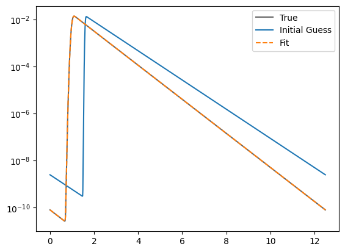
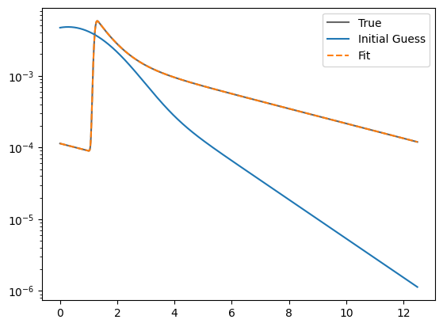
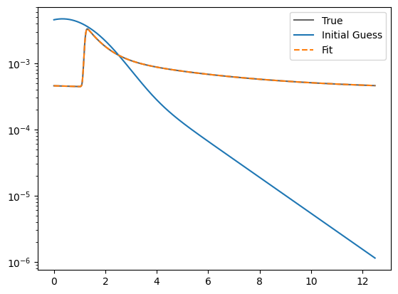
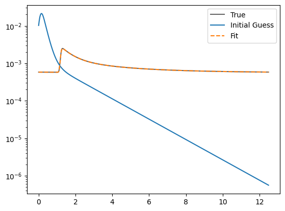
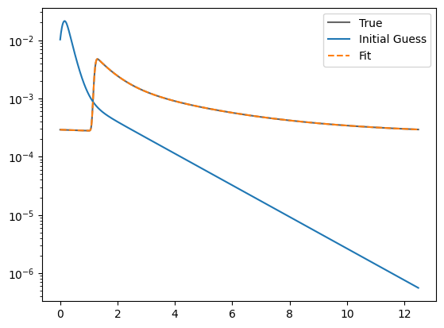
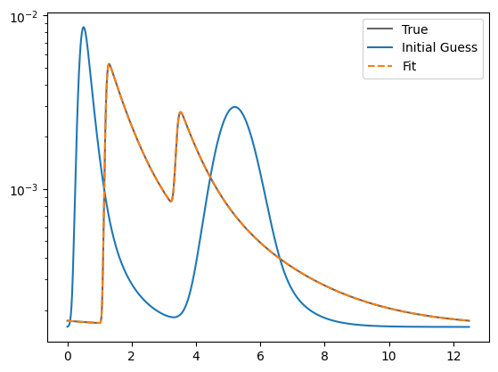
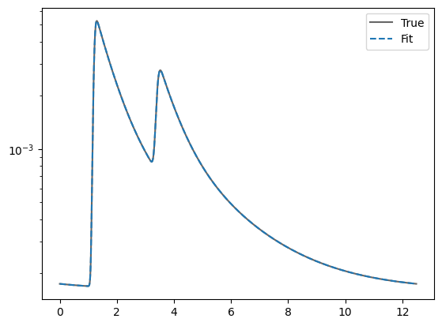

Fitting FLIM Parameters
=======================

This notebook introduces the most basic forms of using the
``FLIMParameters`` objects and tools programmatically. There is an
easy-to-use graphical interface for testing many parameters in the
``siff-napari`` plugin, but that will not be covered here. Instead, look
at the ``siff-napari`` documentation at - ADD LINK HERE -.

.. code-block:: python

    import numpy as np
    import matplotlib.pyplot as plt
    
    from siffpy.core.flim import FLIMParams
    
    
    # Here I'm creating an arrival time axis.
    # In principle this should be built from a
    # SiffReader object, but we're just demo-ing
    # here.
    bin_width = 0.01
    # this is in nanoseconds. 12.5 nanoseconds ~ 80 MHz laser pulse rate
    tau_axis = np.arange(0, 12.5, bin_width)

Fit a single exponential
------------------------

In this first example, we generate an arrival time distribution
corresponding to a single exponential arrival time distribution
convolved with a Gaussian IRF.

.. code-block:: python

    from scipy.optimize import minimize
    from siffpy.core.flim.flimparams import multi_exponential_pdf_from_params
    
    # There are many ways to instantiate a FLIMParams object.
    # In this example, we use a dictionary to specify the parameters.
    monoexp = FLIMParams.from_dict(
        dict(
            exps = [
                dict(tau = 0.6, fraction = 1.0, units = 'nanoseconds'),
            ],
            irf = dict(tau_g = 0.05, mean = 1.0, units = "nanoseconds")
        )
    )
    
    data = monoexp.pdf(tau_axis)
    
    # A not-very-good guess.
    init_guess = np.array((0.7, 1.0, 1.6, 0.02)) # tau f1 irf_mean, irf_sigma
    
    plt.semilogy(
        tau_axis,
        data,
        label = 'True',
        color = '#666666'
    )
    
    plt.semilogy(
        tau_axis,
        multi_exponential_pdf_from_params(tau_axis, init_guess),
        label = 'Initial Guess',
    )
    
    
    res = monoexp.fit_params_to_data(
        data,
        init_guess,
        x_range = tau_axis,
    )
    
    plt.semilogy(
        tau_axis,
        monoexp.pdf(tau_axis),
        label = 'Fit',
        linestyle = '--',
    )
    
    plt.legend()
    
    print(f"{res.niter} iterations : {res.x}")
    
    # Looks great! The green dashed line basically exactly covers the blue

.. parsed-literal::

    90 iterations : [0.6  1.   1.   0.05]

Fitting two exponentials
========================

Now we’ll generate data from a distribution with two exponentials in a
mixture

.. code-block:: python

    biexponential = FLIMParams.from_dict(
        dict(
            exps = [
                dict(tau = 0.6, fraction = 0.3, units = 'nanoseconds'),
                dict(tau = 4.2, fraction = 0.7, units = 'nanoseconds'),
            ],
            irf = dict(tau_g = 0.05, mean = 1.2, units = "nanoseconds")
        )
    )
    
    data = biexponential.pdf(tau_axis)
    
    # A quite bad guess!
    init_guess = np.array((0.2, 0.8, 1.6, 0.2, 0.0, 1.25)) # tau f1 irf_mean, irf_sigma
    
    res = biexponential.fit_params_to_data(
        data,
        init_guess,
        x_range = tau_axis,
    )
    
    plt.semilogy(
        tau_axis,
        data,
        label = 'True',
        color = '#666666'
    )
    
    plt.semilogy(
        tau_axis,
        multi_exponential_pdf_from_params(tau_axis, init_guess),
        label = 'Initial Guess',
        
    )
    
    plt.semilogy(
        tau_axis,
        biexponential.pdf(tau_axis),
        label = 'Fit',
        linestyle = '--',
    )
    
    plt.legend()
    
    print(f"{res.niter} iterations. {res.x}")

.. parsed-literal::

    77 iterations. [0.60000114 0.30000055 4.20000429 0.69999945 1.19999999 0.05000003]

Add background noise
====================

Typically our data comes with some background noise that is independent
of the laser pulse, e.g. background illumination, visual stimuli. We can
also fit keeping that fact in mind.

In this case, we’ll make the noise very strong (half of our “signal” is
actually noise!). This is not a problem.

.. code-block:: python

    biexponential = FLIMParams.from_dict(
        dict(
            exps = [
                dict(tau = 0.6, fraction = 0.3, units = 'nanoseconds'),
                dict(tau = 4.2, fraction = 0.7, units = 'nanoseconds'),
            ],
            irf = dict(tau_g = 0.05, mean = 1.2, units = "nanoseconds"),
            noise = 0.5,
        )
    )
    
    data = biexponential.pdf(tau_axis)
    
    init_guess = np.array((0.2, 0.8, 1.6, 0.2, 0.05, 1.25, 0.0)) # tau f1 ... , irf_mean, irf_sigma, noise
    
    res = biexponential.fit_params_to_data(
        data,
        init_guess,
        x_range = tau_axis,
    )
    
    plt.semilogy(
        tau_axis,
        data,
        label = 'True',
        color = '#666666',
    )
    
    plt.semilogy(
        tau_axis,
        multi_exponential_pdf_from_params(tau_axis, init_guess[:-1]),
        label = 'Initial Guess',
    )
    
    plt.semilogy(
        tau_axis,
        biexponential.pdf(tau_axis),
        label = 'Fit',
        linestyle = '--',
    )
    
    plt.legend()
    
    print(f"{res.niter} iterations. {res.x}.")

.. parsed-literal::

    538 iterations. [0.60000249 0.30000064 4.20003483 0.69999936 1.19999993 0.05000002
     0.49999848].

Pushing it to the limit
=======================

This has got to be much harder: 70% of the signal is noise, and there
are now THREE exponentials producing the data, each approximately to the
same extent! Okay… so this one doesn’t do quite as well. Hopefully you
never have data quite this messy. The curve itself looks pretty okay,
but if you look at the actual values for tau and the fractions… it could
be better

.. code-block:: python

    triexponential = FLIMParams.from_dict(
        dict(
            exps = [
                dict(tau = 0.6, fraction = 0.3, units = 'nanoseconds'),
                dict(tau = 2.1, fraction = 0.3, units = 'nanoseconds'),
                dict(tau = 4.2, fraction = 0.4, units = 'nanoseconds'),
            ],
            irf = dict(tau_g = 0.05, mean = 1.2, units = "nanoseconds"),
            noise = 0.7,
        )
    )
    
    data = triexponential.pdf(tau_axis)
    
    init_guess = np.array((0.2, 0.8, 0.4, 0.0, 1.6, 0.2, 0.05, 0.1, 0.4)) # tau f1 ... , irf_mean, irf_sigma, noise
    
    res = triexponential.fit_params_to_data(
        data,
        init_guess,
        x_range = tau_axis,
    )
    
    plt.semilogy(
        tau_axis,
        data,
        label = 'True',
        color = '#666666',
    )
    
    plt.semilogy(
        tau_axis,
        multi_exponential_pdf_from_params(tau_axis, init_guess[:-1]),
        label = 'Initial Guess',
    )
    
    plt.semilogy(
        tau_axis,
        triexponential.pdf(tau_axis),
        label = 'Fit',
        linestyle = '--',
    )
    
    plt.legend()
    
    print(f"{res.niter} iterations. {res.x}")

.. parsed-literal::

    1000 iterations. [0.60509998 0.30504688 2.41324031 0.42841357 5.07295958 0.26653955
     1.19996303 0.04998284 0.69887643]

Reducing the noise a little gives us a much faster-converging estimate

.. code-block:: python

    triexponential = FLIMParams.from_dict(
        dict(
            exps = [
                dict(tau = 0.6, fraction = 0.3, units = 'nanoseconds'),
                dict(tau = 2.1, fraction = 0.3, units = 'nanoseconds'),
                dict(tau = 4.2, fraction = 0.4, units = 'nanoseconds'),
            ],
            irf = dict(tau_g = 0.05, mean = 1.2, units = "nanoseconds"),
            noise = 0.3,
        )
    )
    
    data = triexponential.pdf(tau_axis)
    
    init_guess = np.array((0.2, 0.8, 0.4, 0.0, 1.6, 0.2, 0.05, 0.1, 0.4)) # tau f1 ... , irf_mean, irf_sigma, noise
    
    res = triexponential.fit_params_to_data(
        data,
        init_guess,
        x_range = tau_axis,
    )
    
    plt.semilogy(
        tau_axis,
        data,
        label = 'True',
        color = '#666666',
    )
    
    plt.semilogy(
        tau_axis,
        multi_exponential_pdf_from_params(tau_axis, init_guess[:-1]),
        label = 'Initial Guess',
    )
    
    plt.semilogy(
        tau_axis,
        triexponential.pdf(tau_axis),
        label = 'Fit',
        linestyle = '--',
    )
    
    plt.legend()
    
    print(f"{res.niter} iterations. {res.x}")

.. parsed-literal::

    910 iterations. [0.60045092 0.30047337 2.12496322 0.30890674 4.24453728 0.39061989
     1.19999659 0.0499987  0.29979893]

Multiple pulses
===============

Let’s make things a little harder yet again. Now we’re going to model a
system in which there are multiple fluorophores with different emission
spectra, and excited by TWO laser sources. Both laser sources excite
both fluorophores (with different efficacy), and our job will be to
wrest the true signal out of this mess.

We have a separate class for this specific instance: the
``MultiPulseFLIMParam``. This section of the code will first solve the
problem the hard way (with regular ``FLIMParams``) to build intuition
and then will use the ``MultiPulseFLIMParam``. Part of the reason this
section is structured this way is that I’m building the
``MultiPulseFLIMParam`` class while I write it! So this may be revised
in the future…

So our tricky distribution was no problem for the solver

.. code-block:: python

    green_fluorophore_pulse_one = FLIMParams.from_dict(
        dict(
            exps = [
                dict(tau = 0.6, fraction = 0.5, units = 'nanoseconds'),
                dict(tau = 2.1, fraction = 0.5, units = 'nanoseconds'),
            ],
            irf = dict(tau_g = 0.05, mean = 1.2, units = "nanoseconds"),
            noise = 0.2,
        )
    )
    
    green_fluorophore_pulse_two = FLIMParams.from_dict(
        dict(
            exps = [
                dict(tau = 0.6, fraction = 0.5, units = 'nanoseconds'),
                dict(tau = 2.1, fraction = 0.5, units = 'nanoseconds'),
            ],
            irf = dict(tau_g = 0.07, mean = 3.4, units = "nanoseconds"),
            noise = 0.2,
        )
    )
    
    frac_pulse_one = 0.7
    frac_pulse_two = 1 - frac_pulse_one
    
    data = (
        frac_pulse_one*green_fluorophore_pulse_one.pdf(tau_axis)
        + frac_pulse_two*green_fluorophore_pulse_two.pdf(tau_axis)
    )

.. code-block:: python

    from scipy.optimize import Bounds, LinearConstraint, minimize
    
    def noisy_multipulse_objective(params, tau_axis, data):
        """
        Params are now of length 1x exp
        + 2xirf parameters plus one frac for each irf
        plus one noise parameter
        """
        noise = params[-1]
        return np.sum(
            (
                np.ones_like(tau_axis[1:])*noise/len(tau_axis) # noise
                + (1-noise)*(
                    params[-5]*multi_exponential_pdf_from_params(tau_axis, params[:-5])[1:]+
                    params[-2]*multi_exponential_pdf_from_params(tau_axis, np.append(params[:4], params[-4:-2]))[1:]
                )
                - data[1:]
            )**2
            / data[1:]
        )
    
    
    init_guess = np.array((0.2, 0.8, 0.7, 0.2, 0.4, 0.1, 0.5, 5.0, 0.5, 0.5, 0.2)) # tau f1 ... , irf_mean, irf_sigma, frac_irf_1, irf_mean_2, irf_sigma_2, frac_irf_2, noise
    
    data = (
        frac_pulse_one*green_fluorophore_pulse_one.pdf(tau_axis)
        + frac_pulse_two*green_fluorophore_pulse_two.pdf(tau_axis)
    )
    multi_pulse_bounds = Bounds(
            lb = [0, 0, 0, 0, 0, 0, 0, 0, 0, 0, 0],
            ub = [np.inf, 1, np.inf, 1, np.inf, np.inf, 1, np.inf, np.inf, 1, 1],
    )
    
    multi_pulse_constraints = [
        LinearConstraint( # sum of fractions = 1
            A = [0,1,0,1,0,0,0,0,0,0,0],
            lb = 1,
            ub = 1,
        ),
        LinearConstraint( # sum of irf_fractions = 1
            A = [0,0,0,0,0,0,1,0,0,1,0],
            lb = 1,
            ub = 1,
        ),
        LinearConstraint( # tau_1 < tau_2
            A = [1,0,-1,0,0,0,0,0,0,0,0],
            lb = -np.inf,
            ub = 0,
        ),
        LinearConstraint( # irf_1 < irf_2
            A = [0,0,0,0,1,0,0,-1,0,0,0],
            lb = -np.inf,
            ub = -0.1,
        ),
    ]
    
    res = minimize(
        noisy_multipulse_objective,
        init_guess,
        args = (tau_axis, data),
        bounds = multi_pulse_bounds,
        constraints = multi_pulse_constraints,
        method = 'trust-constr',
    )
    
    plt.semilogy(
        tau_axis,
        data,
        label = 'True',
        color = '#666666',
    )
    
    plt.semilogy(
        tau_axis,
        (
            init_guess[-1]*np.ones_like(tau_axis)/len(tau_axis) # noise
            +(1-init_guess[-1])*(
                init_guess[-5]*multi_exponential_pdf_from_params(tau_axis, init_guess[:-5])+
                init_guess[-2]*multi_exponential_pdf_from_params(tau_axis, np.append(init_guess[:4], init_guess[-4:-2]))
            )
        ),
        label = 'Initial Guess',
    )
    
    plt.semilogy(
        tau_axis,
        (
            res.x[-1]*np.ones_like(tau_axis)/len(tau_axis) # noise
            +(1-res.x[-1])*(
                res.x[-5]*multi_exponential_pdf_from_params(tau_axis, res.x[:-5])+
                res.x[-2]*multi_exponential_pdf_from_params(tau_axis, np.append(res.x[:4], res.x[-4:-2]))
            )
        ),
        label = 'Fit',
        linestyle = '--',
    )
    
    plt.legend()
    
    print(f"{res.niter} iterations. {res.x}")

.. parsed-literal::

    11 11
    460 iterations. [0.60000365 0.50000455 2.10001736 0.49999545 1.19999991 0.04999997
     0.69999983 3.39999985 0.07000004 0.30000017 0.1999994 ]

Now we can try it with the ``MultiPulseFLIMParams``
---------------------------------------------------

These use a different type of ``Irf`` object: the ``FractionalIrf``,
which allows a different fraction of the fluorescence to come from each
pulse. You can actually just pass in regular ``Irf`` objects and they
will be converted into ``FractionalIrf``\ s with each getting an equal
fraction.

.. code-block:: python

    from siffpy.core.flim import Exp
    from siffpy.core.flim.multi_pulse import FractionalIrf, MultiPulseFLIMParams
    import matplotlib.pyplot as plt
    mpfp = MultiPulseFLIMParams(
        Exp(tau = 0.1, fraction = 0.25, units = 'nanoseconds'),
        Exp(tau = 1.4, fraction = 0.75, units = 'nanoseconds'),
        FractionalIrf(tau_g = 0.05, mean = 0.4, frac = 0.37, units = "nanoseconds"),
        FractionalIrf(tau_g = 0.07, mean = 5.5, frac = 0.63, units = "nanoseconds"),
        noise = 0.2
    )
    
    res = mpfp.fit_params_to_data(
        data,
        #initial_guess=init_guess,
        x_range = tau_axis,
    )
    
    plt.semilogy(
        tau_axis,
        data,
        label = 'True',
        color = '#666666',
    )
    
    plt.semilogy(
        tau_axis,
        mpfp.pdf(tau_axis),
        label = 'Fit',
        linestyle = '--',
    )
    
    plt.legend()

.. parsed-literal::

    <matplotlib.legend.Legend at 0x144a0b7c0>

