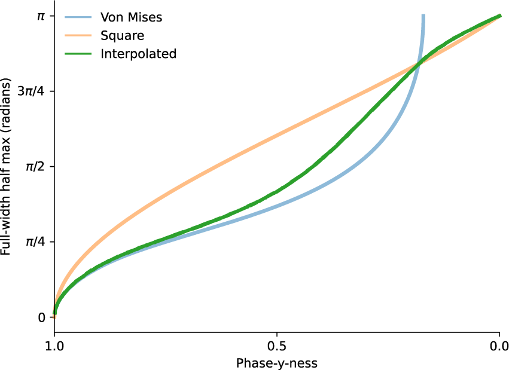

# Phase analyses

Almost everything I measure in the central complex has some benefit
of measuring a "phase-y-ness". The code in this section contains
functions for keeping track of phase as a complex number and estimating
the breadth of a phase-y signal.

TODO: document the error func

